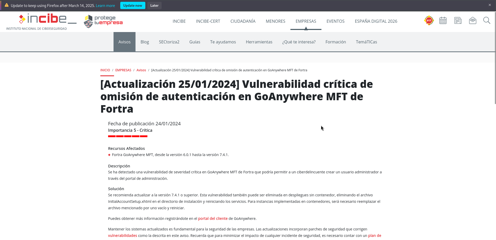
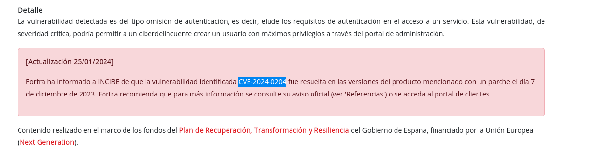
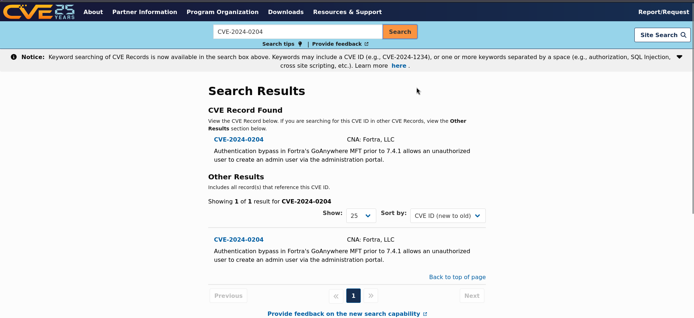
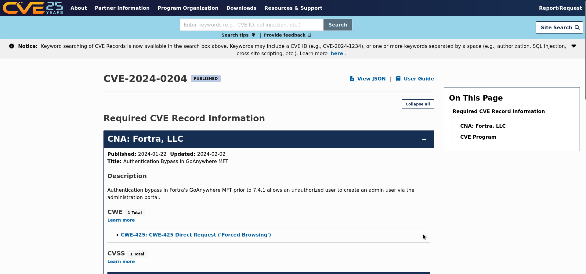
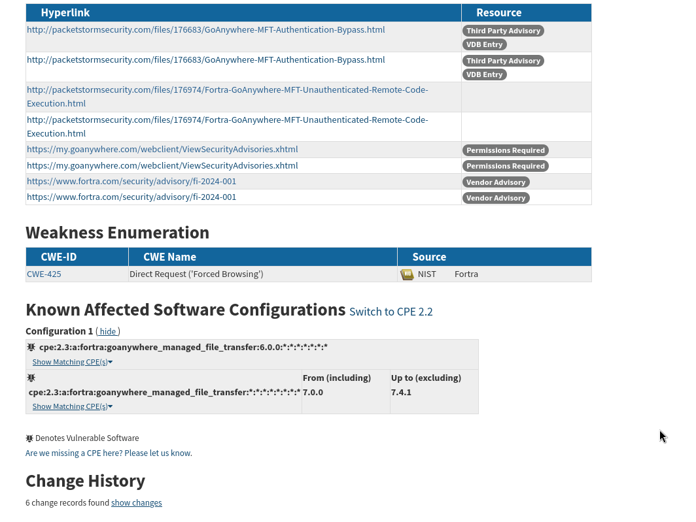
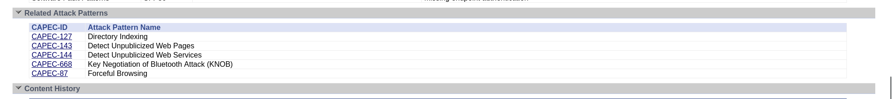
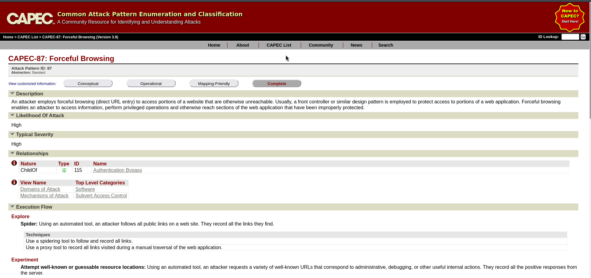

# Trazado de la Vulnerabilidad CVE-2024-0204 : GoAnywhere MFT de Fortra

Este documento describe el trazado de la vulnerabilidad **CVE-2024-0204** en la aplicación **GoAnywhere MFT** de Fortra, que permite la omisión de autenticación y puede ser explotada para obtener acceso no autorizado al sistema.

## 1. Introducción

La vulnerabilidad **CVE-2024-0204** afecta a la aplicación GoAnywhere MFT de Fortra, la cual es una plataforma de intercambio de archivos que permite a las empresas compartir datos de forma segura. Según el artículo de [INCIBE](https://www.incibe.es/empresas/avisos/vulnerabilidad-critica-de-omision-de-autenticacion-en-goanywhere-mft-de-fortra), esta vulnerabilidad es crítica ya que permite a un atacante omitir el proceso de autenticación y acceder al sistema de manera no autorizada.

## 2. Fuentes Consultadas

Para realizar este trazado, se han consultado diversas fuentes oficiales que proporcionan información detallada sobre la vulnerabilidad. A continuación se describen las fuentes utilizadas una vez obtenido el cve:

### 2.1. CVE.org

- **CVE ID**: [CVE-2024-0204 ](https://cve.org/CVERecord?id=CVE-2024-0204 )
- **Descripción**: La vulnerabilidad permite a un atacante omitir la autenticación en la aplicación, lo que puede permitirle acceder a los recursos protegidos de GoAnywhere MFT sin necesidad de proporcionar credenciales válidas.

Podemos descargarla o acceder a su información, desde la página de cve.org dándole al enlace [View JSON](CVE-2024-0204.json)

### 2.2. NVD - National Vulnerability Database

- **Enlace**: [CVE-2023-2024 en NVD](https://nvd.nist.gov/vuln/detail/CVE-2024-0204)
- **CVSS Score**: La vulnerabilidad tiene una puntuación de **9.8** en CVSS, lo que indica que es **crítica**.
- **Vectores de ataque**: Un atacante puede explotar esta vulnerabilidad de manera remota sin interacción del usuario, lo que la convierte en una amenaza de alto riesgo.
  

### 2.3. CWE - Common Weakness Enumeration

- **CWE ID**: [CWE-425: Improper Authentication](https://cwe.mitre.org/data/definitions/425.html)
- **Descripción**: Esta vulnerabilidad se asocia con la debilidad de autenticación incorrecta, lo que permite a un atacante acceder a un sistema sin los mecanismos adecuados de verificación de identidad.

Vemos los posibles patrones de ataque relacionados

### 2.4. CAPEC - Common Attack Pattern Enumeration and Classification

- **Enlace**: [CAPEC-87: Missing Authentication for Critical Function](https://capec.mitre.org/data/definitions/87.html)
- **Descripción**: El patrón de ataque relacionado, sobre la vulnerabilidad.

